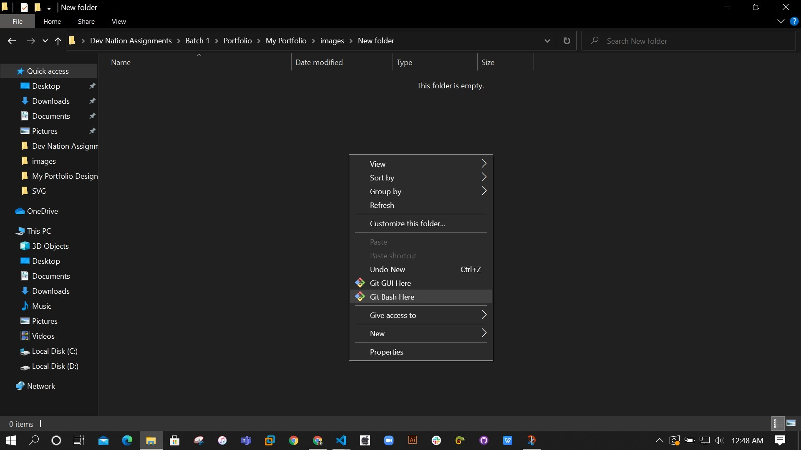

# TODO-Tasks-app

## Help you to make a list of  your daily task to make you focus on your daily routines 
-------------------------------------------------
#### Visit the app by clicking this [TODO Tasks app](https://fariha-todo-task-app.netlify.app/)


_First Section (adding,delete and search of tasks)_

_Second Section (view of your completed tasks list)_


#### Feel free to change or customize as much as you want

#### It sound awesome if you have a much better ideas to improve this

#### Do contribute and share your ideas with all other developers so that they can take advantage of your customization

Table of Content
================

* * * * *

-   [Sections](#)
-   [Getting started](#)
-   [How to get files](#)
-   [Change and Customization](#)
-   [How this app's code help you](#)
-   [Deployment](#)


Sections
========

* * * * *

1.  add,remove,search   
2.  completed Tasks

Getting Started
===============

* * * * *

These instructions will get you a copy of the project and running on
your local machine for development and testing purposes

You will need to install [Git](https://git-scm.com/downloads) and [Node.js](https://nodejs.org/en/download/) on your local machine/computer

How to get files
================

* * * * *

When you have done with installation!

Go to your required directory, and open GIT command line as shown below


Here you get a command line interface

put command to clone the files on your local computer

```git
\$ git clone https://github.com/fahadhassan1213/ToDo-Tasks-app.git 
```
Change and Customization
========================

* * * * *

You can change the `app.js` file to addd more functionalities to the app


How this app's code helps you
========================
In the `app.js` file you can get the javascript code 

Using the code you can be able to creat a list in which you can allow the
user to ADD,REMOVE/DELETE,SEARCH the list items
You can also allow the user to recover the deleted items from the list

#### The following code is divided into sections of code
You have to just check the working of code and apply this code in you project and make your projects more awesome

_Adding the Items to List_

```js
addInput.addEventListener('submit',(e) =>{
    e.preventDefault();
    const valueOfInput = addInput.addIn.value.trim();
    if(valueOfInput.length){
        addTask(valueOfInput);
    }
    addInput.reset();
    

})

const addTask = (valueOfInput) =>{

    list.innerHTML += 
    `<div class="list-item d-flex justify-content-between align-items-center my-1">
    <li
      class="list-group-item d-flex justify-content-between align-items-center "
    ><div>
      <span>${valueOfInput}</span>
    </div>
      <i class="fas fa-trash-alt delete mx-1"></i>
    </li>
    <i class="fas fa-check-circle check mx-2"></i>
    </div>`
}
```

_Delete Items_
```js
list.addEventListener('click' ,(e) =>{
    
    if(e.target.classList.contains('delete')){
        e.target.parentElement.parentElement.remove();
    }
    else if(e.target.classList.contains('check')){
        e.target.parentElement.remove();
        checkedList.innerHTML +=
        `<li class="list-group-item d-flex justify-content-between align-items-center">
        <span style="text-decoration:line-through;">${e.target.parentElement.textContent}</span>
        <i class="fas fa-reply reverse"></i>
        </li>`

    }
})

```
_Reverse completed items_

```js

reverse.addEventListener('click', e => {
    if(e.target.classList.contains('reverse')){
        e.target.parentElement.remove();

        list.innerHTML +=
        `<div class="list-item d-flex justify-content-between align-items-center my-1">
    <li
      class="list-group-item d-flex justify-content-between align-items-center "
    ><div>
      <span>${e.target.parentElement.children[0].textContent}</span>
    </div>
      <i class="fas fa-trash-alt delete mx-1"></i>
    </li>
    <i class="fas fa-check-circle check mx-2"></i>
    </div>`
    }
})


```

_Search/Filter Items_

```js
search.addEventListener('keyup',() =>{
    const searchValue = search.search.value.toLowerCase().trim();
    filtering(searchValue);

})


const filtering = (searchValue) =>{
    const listArray = Array.from(list.children);
    listArray.filter(listItems => !listItems.textContent.toLowerCase().includes(searchValue)).forEach(item => item.classList.add('filtered'))

    listArray.filter(listItems => listItems.textContent.toLowerCase().includes(searchValue)).forEach(item => item.classList.remove('filtered'))
}


```


Deployment
========================
When you have done with the setup you should host your site online

You can use [NETLIFY](https://www.netlify.com/) for deployment of your

for more information please read [hosting on Netlify](https://create-react-app.dev/docs/deployment/#netlify)

